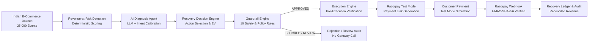

# RecoverAI — Autonomous Revenue Recovery Agent

[](https://www.python.org/)
[](https://fastapi.tiangolo.com/)
[](https://nextjs.org/)
[](https://www.sqlalchemy.org/)
[](https://alembic.sqlalchemy.org/)
[](https://razorpay.com/)
[](https://openai.com/)
[](#-automated-testing)

**RecoverAI** is an AI-powered revenue recovery agent for e-commerce businesses. It identifies high-risk abandoned or failed payment opportunities, diagnoses the likely reason behind revenue loss, selects an appropriate recovery action, applies merchant-configured guardrails, and executes approved recovery workflows through Razorpay Test Mode.

> *Future Roadmap*: Expansion into recurring SaaS subscription dunning and B2B invoice collections is planned as future phases; the core platform is purpose-built for high-volume Indian e-commerce checkout recovery.

---

## 🏗️ End-to-End Autonomous Pipeline Architecture



### Architectural Guardrails & Invariants:
1. **AI Never Calls Razorpay Directly**: The LLM diagnosis is treated as one input to the deterministic Decision Engine, which is gated by the Guardrail Engine before the Execution Engine can interface with Razorpay.
2. **Test Mode Exclusivity**: Operates strictly against the Razorpay Test Mode API (`rzp_test_...`). No live financial transactions take place.
3. **Independent Pre-Execution Re-verification**: Immediately before generating a payment link, the Execution Engine independently re-checks live cart status, customer cooldown, and attempt caps.
4. **Idempotency Guarantee**: Repeated execution calls return existing payment links without duplicating Razorpay resources.
5. **Cryptographic Webhook Security**: Webhooks are verified using raw request body bytes and HMAC-SHA256 signatures before reconciliation.

---

## 📁 Project Layout

```text
RecoverAI-Autonomous Payment Recovery Agent/
├── .env.example                     # Centralized environment variable template
├── .gitignore                       # Git ignore rules for env, cache, and DBs
├── README.md                        # Project documentation and setup guide
│
├── frontend/                        # Next.js 14 App Router + Tailwind CSS
│   ├── src/
│   │   ├── app/                     # App router pages, layout, and global styles
│   │   ├── components/              # UI components (Diagnostics, Charts, Navbar)
│   │   └── lib/                     # API client (`api.ts`) and TypeScript types
│
├── backend/                         # FastAPI Python Application
│   ├── app/
│   │   ├── api/v1/                  # Versioned API routes (/health, /payments, /ai, /decision, /guardrails, /execution, /webhooks, /recovery)
│   │   ├── core/                    # Configuration (pydantic-settings) & DB engine
│   │   ├── models/                  # SQLAlchemy ORM declarative registry
│   │   ├── schemas/                 # Pydantic validation schemas
│   │   └── main.py                  # FastAPI entrypoint with route aliases
│   ├── config/                      # Recovery policy configurations
│   ├── data_pipeline/               # Batch analysis & evaluation scripts
│   ├── routes/                      # Route proxies (execution, webhooks, recovery)
│   ├── services/                    # Core service layer
│   │   ├── action_scoring.py        # EV & friction action scoring
│   │   ├── decision_engine.py       # Recovery Decision Engine
│   │   ├── execution_engine.py      # Recovery Execution Layer
│   │   ├── guardrail_engine.py      # 10 Safety guardrail checks
│   │   ├── razorpay_service.py      # Isolated Razorpay SDK integration
│   │   └── risk_engine.py           # Deterministic risk scoring
│   ├── utils/                       # Currency utilities (rupees <-> paise)
│   ├── run.py                       # CLI server runner
│   └── requirements.txt             # Python dependencies
│
├── database/                        # Database models & persistence layer
│   ├── alembic/                     # Database migrations (0001 & 0002)
│   ├── ai_decisions.py              # AI diagnosis decision records
│   ├── audit_models.py              # GuardrailAuditLog table & query helpers
│   ├── database.py                  # SQLAlchemy session manager & schema sync
│   ├── decision_models.py           # RecoveryDecision persistence model
│   ├── execution_models.py          # RecoveryExecution model (Day 7)
│   ├── models.py                    # Customer, Transaction, RecoveryCase
│   ├── recovery_models.py           # RecoveryRecord outcome model (Day 7)
│   └── session.py                   # Session adapter
│
├── ai/                              # AI Agent Prompt Engineering & Schemas
│   ├── diagnosis.py                 # LLM caller, validation, fallbacks
│   ├── guardrail_schemas.py         # Guardrail & execution state schemas
│   ├── prompts.py                   # System & user prompt templates
│   └── schemas.py                   # Pydantic schemas & enums
│
├── data/                            # Data Layer
│   ├── raw/                         # Raw dataset (untracked)
│   ├── processed/                   # Processed events CSV (untracked)
│   └── samples/                     # Curated samples & Day 7 demo cases (tracked)
│
├── tests/                           # Automated Pytest Suite (89 tests)
│   ├── test_ai_diagnosis.py         # AI diagnosis & fallback tests
│   ├── test_data_pipeline.py        # Data pipeline processing tests
│   ├── test_db.py                   # DB connection tests
│   ├── test_decision_engine.py      # Action scoring & decision engine tests
│   ├── test_execution_engine.py     # Execution engine & pipeline tests
│   ├── test_guardrail_engine.py     # 10 Modular guardrail tests
│   ├── test_health.py               # Health check API tests
│   ├── test_models.py               # Database model tests
│   ├── test_razorpay_service.py     # Razorpay SDK & currency conversion tests
│   ├── test_risk_engine.py          # Deterministic risk engine tests
│   ├── test_seed.py                 # Database seed tests
│   └── test_webhooks.py             # Webhook verification & reconciliation tests
│
└── docs/                            # Technical Architecture & Analysis Docs
    ├── api_spec.md                  # REST API endpoints & schemas
    ├── architecture.md              # Technical design specification
    ├── day5-decision-analysis.md    # Decision Engine evaluation report
    ├── day6-guardrail-analysis.md   # Guardrail Engine evaluation report
    └── day7-execution-analysis.md   # Execution & Razorpay analysis report
```

---

## ⚡ Tech Stack

| Layer | Technology | Purpose |
|---|---|---|
| **Backend API** | FastAPI (Python 3.10+) | High-performance asynchronous REST API |
| **Execution Gateway** | Razorpay Python SDK | Test Mode payment link creation & webhook verification |
| **AI Diagnosis** | OpenAI API (`gpt-4o-mini`) | Contextual recovery diagnosis with deterministic fallbacks |
| **ORM & Database** | SQLAlchemy 2.0 + SQLite / PostgreSQL | Persisted transactions, decisions, executions, and audits |
| **Schema Migrations** | Alembic | Version-controlled database migrations |
| **Data Processing** | Pandas + NumPy | E-commerce event ingestion and feature engineering |
| **Frontend Dashboard** | Next.js 14 (App Router) + TypeScript | Real-time recovery analytics dashboard |
| **Styling & Charts** | Tailwind CSS + Recharts | Responsive layout, dark mode, dunning curves |

---

## 🧪 Automated Testing

RecoverAI maintains an extensive automated test suite covering all functional and safety layers:

```bash
# Run quiet test suite
pytest -q

# Run with verbose output
pytest tests/ -v
```

### Current Test Execution Summary:
```text
89 passed, 3 warnings in 5.04s
```

### Coverage by Component:
| Test Module | Tests | Layer Tested |
|---|:---:|---|
| [`tests/test_ai_diagnosis.py`](tests/test_ai_diagnosis.py) | **9** | Context construction, LLM diagnosis, fallback reliability |
| [`tests/test_data_pipeline.py`](tests/test_data_pipeline.py) | **6** | Kaggle raw data transformation & canonical event schemas |
| [`tests/test_db.py`](tests/test_db.py) | **1** | Database connectivity & session management |
| [`tests/test_decision_engine.py`](tests/test_decision_engine.py) | **11** | Action eligibility, EV scoring, priority assignment |
| [`tests/test_execution_engine.py`](tests/test_execution_engine.py) | **9** | Pre-execution validation, link generation, idempotency, end-to-end pipeline |
| [`tests/test_guardrail_engine.py`](tests/test_guardrail_engine.py) | **18** | 10 Safety checks, fail-closed mechanics, review escalation |
| [`tests/test_health.py`](tests/test_health.py) | **5** | Application startup, health probes, route mounts |
| [`tests/test_models.py`](tests/test_models.py) | **2** | SQLAlchemy ORM entity relationships and constraints |
| [`tests/test_razorpay_service.py`](tests/test_razorpay_service.py) | **8** | Rupee <-> paise precision, client mock, error handling, signature checks |
| [`tests/test_risk_engine.py`](tests/test_risk_engine.py) | **9** | Intent heuristics, abandonment detection, score formulas |
| [`tests/test_seed.py`](tests/test_seed.py) | **4** | Sample data seeding and validation |
| [`tests/test_webhooks.py`](tests/test_webhooks.py) | **7** | Signature verification, payment success/failure, expiration, duplicate idempotency |
| **Total** | **89** | **100% Passing** |

---

## 💳 Razorpay Test Mode Setup Walkthrough

To test live payment recovery link generation and webhook reconciliation with Razorpay Test Mode:

### Step 1: Access Razorpay Test Mode
1. Log into your [Razorpay Dashboard](https://dashboard.razorpay.com/).
2. Toggle the dashboard switch from **Live** to **Test Mode** (top-right banner).

### Step 2: Generate Test API Credentials
1. Navigate to **Account & Settings** $\rightarrow$ **API Keys**.
2. Click **Generate Test Key**.
3. Copy the generated `Key ID` (starts with `rzp_test_...`) and `Key Secret`.

### Step 3: Configure Environment Variables
Copy `.env.example` to `.env` in your project root:
```bash
copy .env.example .env
```
Update your `.env` file with the test credentials:
```env
RAZORPAY_KEY_ID=rzp_test_your_key_id_here
RAZORPAY_KEY_SECRET=your_test_key_secret_here
RAZORPAY_CURRENCY=INR
RAZORPAY_WEBHOOK_SECRET=your_custom_webhook_secret_here
```
> [!IMPORTANT]
> Never commit `.env` to version control. The repository `.gitignore` explicitly prevents `.env` files from being tracked.

### Step 4: Configure Webhook Endpoint
1. In Razorpay Dashboard, navigate to **Account & Settings** $\rightarrow$ **Webhooks**.
2. Add a new webhook URL: `http://<your-host>:8000/api/webhooks/razorpay` (or your ngrok/tunnel URL during local development).
3. Set the Secret to match `RAZORPAY_WEBHOOK_SECRET`.
4. Select active events: `payment_link.paid`, `payment.captured`, `payment.failed`, `payment_link.expired`.

### Step 5: Start the Application & Trigger Recovery
```bash
# 1. Start the FastAPI backend
python backend/run.py

# 2. Trigger an end-to-end recovery pipeline via cURL or Swagger UI:
curl -X POST "http://localhost:8000/api/recovery/run" \
     -H "Content-Type: application/json" \
     -d '{"event_data": {"event_id": "evt_test_101", "customer_id": "cust_vip", "cart_value": 4999.0, "risk_score": 90.0, "purchase_status": "abandoned"}}'
```
The response returns a live Razorpay Test payment link:
```json
{
  "event_id": "evt_test_101",
  "guardrail_status": "APPROVED",
  "execution_status": "CREATED",
  "payment_link_id": "plink_XXXXXXXXXXXX",
  "payment_url": "https://rzp.io/i/XXXXXXXX"
}
```

### Step 6: Complete Test Payment & Verify Webhook
1. Open the returned `payment_url` in your browser.
2. Select Razorpay Test Card or Test UPI details to complete the mock checkout.
3. Razorpay sends the signed webhook to `POST /api/webhooks/razorpay`.
4. RecoverAI validates the HMAC-SHA256 signature, updates `RecoveryExecution.status` to `SUCCEEDED`, and registers an immutable entry in the `recovery_records` ledger.

---

## 🚀 Local Development Quickstart

### 1. Backend Setup
```bash
# 1. Install Python dependencies
pip install -r backend/requirements.txt

# 2. Run database migrations (optional, init_db runs automatically)
alembic -c database/alembic.ini upgrade head

# 3. Start backend API server
python backend/run.py
```
- **Backend API**: [http://localhost:8000](http://localhost:8000)
- **Interactive Swagger Docs**: [http://localhost:8000/docs](http://localhost:8000/docs)
- **Health Check Endpoint**: [http://localhost:8000/api/health](http://localhost:8000/api/health)

### 2. Frontend Setup
```bash
cd frontend
npm install
npm run dev
```
- **Frontend Dashboard**: [http://localhost:3000](http://localhost:3000)

---

## 📜 License
MIT License. Built for autonomous e-commerce revenue recovery.
