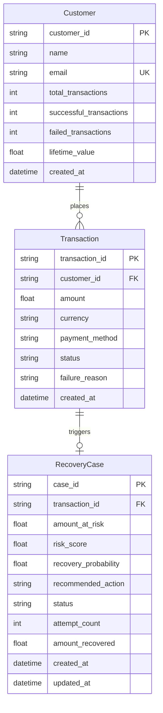

# RecoverAI Database Schema & Data Models (Day 2)

## Overview
RecoverAI's Day 2 Data Foundation provides the persistent storage, entity relationships, and realistic synthetic customer payment history required by the upcoming Day 3 **Revenue Risk Engine**.

---

## Entity-Relationship Diagram



---

## Models Specification

### 1. Customer (`database/models.py:Customer`)
Represents merchant customers with aggregated lifetime transaction metrics.

| Column | Type | Constraints | Description |
| :--- | :--- | :--- | :--- |
| `customer_id` | String(64) | PRIMARY KEY, INDEX | Unique customer identifier (e.g., `cust_7f18b3ec48a1`) |
| `name` | String(255) | NOT NULL | Customer's full name |
| `email` | String(255) | UNIQUE, INDEX, NOT NULL | Primary email address |
| `total_transactions` | Integer | NOT NULL, DEFAULT 0 | Count of all payment attempts |
| `successful_transactions`| Integer | NOT NULL, DEFAULT 0 | Count of successful transactions |
| `failed_transactions` | Integer | NOT NULL, DEFAULT 0 | Count of failed transactions |
| `lifetime_value` | Float | NOT NULL, DEFAULT 0.0 | Cumulative sum of successful payments (INR) |
| `created_at` | DateTime | NOT NULL, DEFAULT utcnow | Timestamp when customer joined |

**Relationships:**
- `transactions`: 1-to-many relationship with `Transaction`, cascading deletes.

---

### 2. Transaction (`database/models.py:Transaction`)
Represents an individual payment attempt via payment gateways.

| Column | Type | Constraints | Description |
| :--- | :--- | :--- | :--- |
| `transaction_id` | String(64) | PRIMARY KEY, INDEX | Unique transaction ID (e.g., `txn_59d3e89bc104a1`) |
| `customer_id` | String(64) | FOREIGN KEY (`customers.customer_id`), INDEX, NOT NULL | Foreign key referencing customer |
| `amount` | Float | NOT NULL | Payment amount (e.g., ₹2,500.00) |
| `currency` | String(10) | NOT NULL, DEFAULT 'INR' | Currency code |
| `payment_method` | String(30) | NOT NULL | Method: `UPI`, `CARD`, `NETBANKING`, `WALLET` |
| `status` | String(30) | NOT NULL | Status: `success`, `failed`, `pending`, `abandoned` |
| `failure_reason` | String(50) | NULLABLE | Reason taxonomy (populated only for failed/abandoned) |
| `created_at` | DateTime | NOT NULL, INDEX, DEFAULT utcnow | Timestamp of the transaction attempt |

**Failure Reasons Taxonomy:**
- `bank_decline`
- `insufficient_funds`
- `bank_timeout`
- `network_error`
- `authentication_failed`
- `payment_method_expired`
- `unknown`

**Relationships:**
- `customer`: Many-to-1 relationship with `Customer`.
- `recovery_case`: 1-to-1 optional relationship with `RecoveryCase`, cascading deletes.

---

### 3. RecoveryCase (`database/models.py:RecoveryCase`)
Tracks autonomous payment recovery lifecycle, AI risk assessments, and action history.

| Column | Type | Constraints | Description |
| :--- | :--- | :--- | :--- |
| `case_id` | String(64) | PRIMARY KEY, INDEX | Unique recovery case ID (e.g., `case_c8a912e73f4b`) |
| `transaction_id` | String(64) | FOREIGN KEY (`transactions.transaction_id`), UNIQUE, INDEX, NOT NULL | Linked failed transaction |
| `amount_at_risk` | Float | NOT NULL | Amount at risk (equals transaction amount) |
| `risk_score` | Float | NULLABLE | Computed risk score (populated in Day 3) |
| `recovery_probability`| Float | NULLABLE | Machine learning recovery probability (Day 3/4) |
| `recommended_action` | String(100) | NULLABLE | Recommended strategy (e.g., `retry_with_discount`, `smart_dunning`) |
| `status` | String(50) | NOT NULL, DEFAULT 'pending' | Lifecycle: `pending`, `in_progress`, `recovered`, `failed`, `abandoned` |
| `attempt_count` | Integer | NOT NULL, DEFAULT 0 | Number of dunning / retry attempts |
| `amount_recovered` | Float | NOT NULL, DEFAULT 0.0 | Amount successfully recovered |
| `created_at` | DateTime | NOT NULL, DEFAULT utcnow | Case creation timestamp |
| `updated_at` | DateTime | NOT NULL, DEFAULT utcnow | Last modification timestamp |

**Relationships:**
- `transaction`: 1-to-1 relationship with `Transaction`.

---

## Customer Archetypes & Synthetic Generator (`database/seed.py`)

The synthetic dataset generates ~1,000 customers and ~5,000+ transactions representing 5 customer behavioral archetypes:

```
┌─────────────────┬───────────┬──────────────┬──────────────┬──────────────────────────────────────────┐
│ Archetype       │ Customers │ Txns / Cust  │ Success Rate │ Behavioral Profile                       │
├─────────────────┼───────────┼──────────────┼──────────────┼──────────────────────────────────────────┤
│ 1. Loyal        │    200    │   11 - 13    │    ~92%      │ High LTV, frequent recurring payments    │
│ 2. New          │    250    │      1       │      0%      │ Failed initial onboarding txn, no history│
│ 3. High-Value   │    100    │    4 - 6     │    ~80%      │ ₹50,000+ total volume, high ticket size  │
│ 4. Problematic  │    150    │    6 - 8     │    ~40%      │ Frequent declines & timeouts             │
│ 5. Standard     │    300    │    3 - 5     │    ~80%      │ Everyday natural distribution            │
└─────────────────┴───────────┴──────────────┴──────────────┴──────────────────────────────────────────┘
```

### Payment Method Biasing

```
UPI (~48%)        ──► Biased to bank_timeout (38%), bank_decline (25%), network_error (22%)
CARD (~32%)       ──► Biased to insufficient_funds (30%), authentication_failed (28%), expired (20%)
NETBANKING (~12%) ──► Biased to bank_timeout (40%), bank_decline (25%), network_error (20%)
WALLET (~8%)      ──► Biased to insufficient_funds (45%), bank_decline (25%), network_error (15%)
```

---

## Seeding & Running

To generate or reset the synthetic data foundation:

```bash
# From workspace root
python database/seed.py
```

To run the automated validation test suite:

```bash
python -m pytest tests/
```
