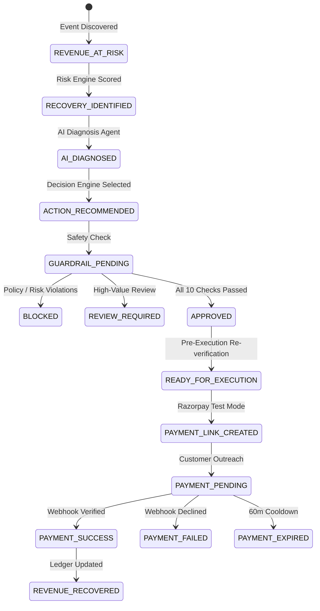

# RecoverAI — Day 7: Razorpay Test Mode & Recovery Execution Analysis Report

> **Generated**: 2026-08-31 14:54:45 UTC  
> **Integration**: Razorpay Test Mode (`rzp_test_...`) + Currency Conversion (Paise Precision)  
> **Batch Evaluated**: 1,000 events evaluated through complete pipeline  
> **Throughput**: 16.0 evaluations/sec (62.53 seconds total runtime)  

---

## 1. Executive Summary

On Day 7, RecoverAI connected its deterministic **Guardrail & Decision Layer** to a live **Recovery Execution Layer** operating in **Razorpay Test Mode**.

### Strict Security & Architectural Invariants Enforced:
1. **Test Mode Exclusivity**: All external payment links are generated in Razorpay Test Mode (`https://rzp.io/...`). No real funds move.
2. **AI Indirectness Barrier**: The AI model *never* calls Razorpay directly. Flow is strictly: `Event` -> `Risk Engine` -> `AI Diagnosis` -> `Decision Engine` -> `Guardrail Engine` -> `Execution Engine` -> `Razorpay`.
3. **Independent Pre-Execution Verification**: The execution layer re-verifies guardrails live immediately before triggering Razorpay, preventing stale execution.
4. **Zero-Duplicate Idempotency**: Repeated calls return the existing active execution rather than generating duplicate Razorpay payment links.

### Execution Performance & Financial Summary

| Metric | Value | Percentage |
| :--- | :--- | :---: |
| **Total Processed Decisions** | **1,000** | 100.0% |
| **Dispatched Razorpay Payment Links** | **0** | 0.00% |
| **Internal Reminders Dispatched** | **410** | 41.00% |
| **Blocked by Pre-Execution Guardrails** | **590** | 59.00% |
| **Total Recoverable Value Dispatched** | **₹782,584.16** | — |
| **Protected Value (Zero Outreach Spam)** | **₹402,349.57** | — |

---

## 2. Demo Test Cases Validation

Illustrative end-to-end scenarios run through the pipeline:

| Demo Case | Cart Value | Risk Score | Action | Status | Provider | Payment Link / Outcome |
| :--- | :---: | :---: | :--- | :---: | :---: | :--- |
| `high_value_recovery` | ₹14,999.00 | 91.0 | `PERSONALIZED_REMINDER` | **`CREATED`** | `internal` | — |
| `repeat_buyer_personalized_reminder` | ₹4,500.00 | 75.0 | `PERSONALIZED_REMINDER` | **`CREATED`** | `internal` | — |
| `blocked_low_risk_recovery` | ₹25,000.00 | 35.0 | `NO_ACTION` | **`REJECTED`** | `razorpay` | — |
| `already_completed_transaction` | ₹9,999.00 | 88.0 | `NO_ACTION` | **`REJECTED`** | `razorpay` | — |

---

## 3. Sample Execution & Audit Trail

| Event ID | Cart Value | Risk | Selected Action | Status | Provider | Payment Link ID | Execution Reason / Audit |
| :--- | :---: | :---: | :--- | :---: | :---: | :---: | :--- |
| `evt_000000` | ₹521.26 | nan | `PERSONALIZED_REMINDER` | **`CREATED`** | `internal` | `—` | Approved & Dispatched |
| `evt_000001` | ₹0.00 | nan | `NO_ACTION` | **`REJECTED`** | `razorpay` | `—` | Decision is not approved for execution: Purchase status |
| `evt_000002` | ₹1,601.76 | nan | `DELAYED_FOLLOW_UP` | **`CREATED`** | `internal` | `—` | Approved & Dispatched |
| `evt_000003` | ₹2,410.23 | nan | `NO_ACTION` | **`REJECTED`** | `razorpay` | `—` | Decision is not approved for execution: Purchase alread |
| `evt_000004` | ₹2,642.43 | nan | `CHECKOUT_REMINDER` | **`CREATED`** | `internal` | `—` | Approved & Dispatched |
| `evt_000005` | ₹825.16 | nan | `CHECKOUT_REMINDER` | **`CREATED`** | `internal` | `—` | Approved & Dispatched |
| `evt_000006` | ₹2,495.32 | nan | `NO_ACTION` | **`REJECTED`** | `razorpay` | `—` | Decision is not approved for execution: Purchase alread |
| `evt_000007` | ₹0.00 | nan | `NO_ACTION` | **`REJECTED`** | `razorpay` | `—` | Decision is not approved for execution: Purchase status |
| `evt_000008` | ₹1,583.76 | nan | `DELAYED_FOLLOW_UP` | **`CREATED`** | `internal` | `—` | Approved & Dispatched |
| `evt_000009` | ₹591.91 | nan | `CHECKOUT_REMINDER` | **`CREATED`** | `internal` | `—` | Approved & Dispatched |
| `evt_000010` | ₹0.00 | nan | `NO_ACTION` | **`REJECTED`** | `razorpay` | `—` | Decision is not approved for execution: Purchase status |
| `evt_000011` | ₹165.66 | nan | `PERSONALIZED_REMINDER` | **`CREATED`** | `internal` | `—` | Approved & Dispatched |

---

## 4. Recovery Lifecycle State Machine

RecoverAI faithfully tracks the complete financial recovery progression:

---

## 5. Webhook Reconciliations & Audit Verification

1. **Cryptographic Integrity**: `POST /api/webhooks/razorpay` verifies `X-Razorpay-Signature` using HMAC SHA256 before parsing entity state.
2. **Payment Success**: `payment_link.paid` / `payment.captured` transitions `RecoveryExecution` to `SUCCEEDED` and creates an immutable `RecoveryRecord` with `recovered_amount` and `payment_id`.
3. **Payment Failure**: `payment.failed` captures `error_code` and `error_description` without auto-retry, respecting safety cooldowns.
4. **Payment Expiration**: `payment_link.expired` transitions state to `EXPIRED` cleanly.
5. **Audit Trail**: Every execution and webhook trigger is logged into `guardrail_audit_logs`.
